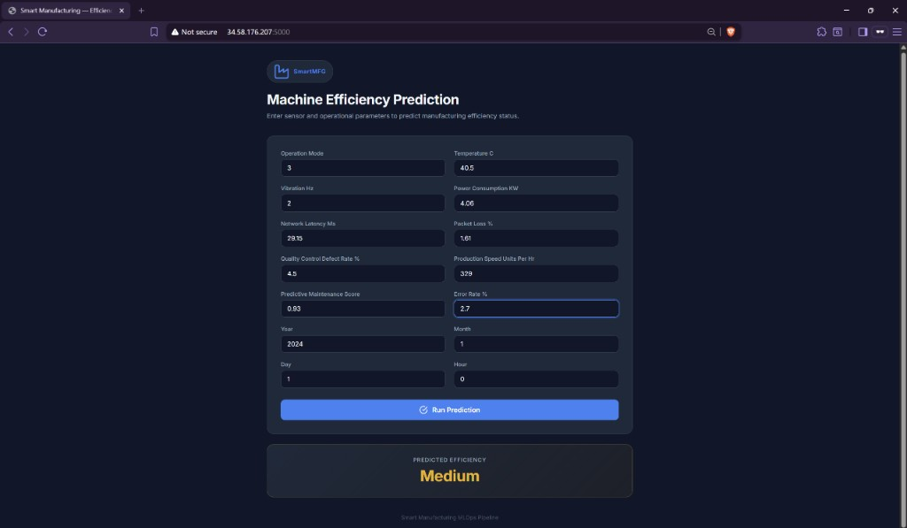
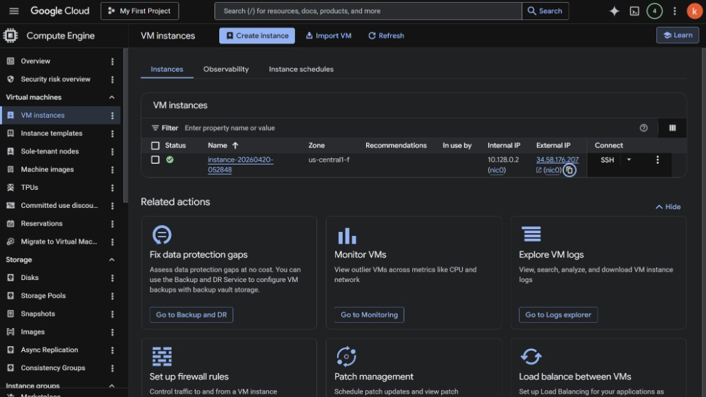
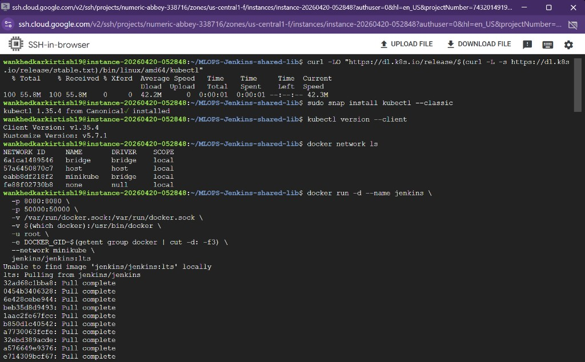
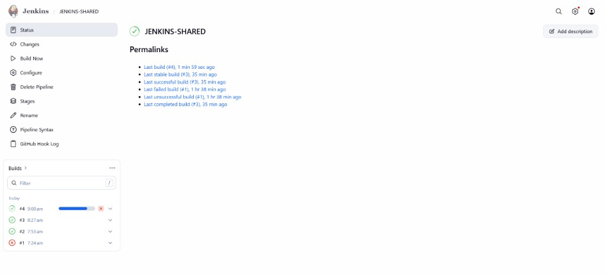
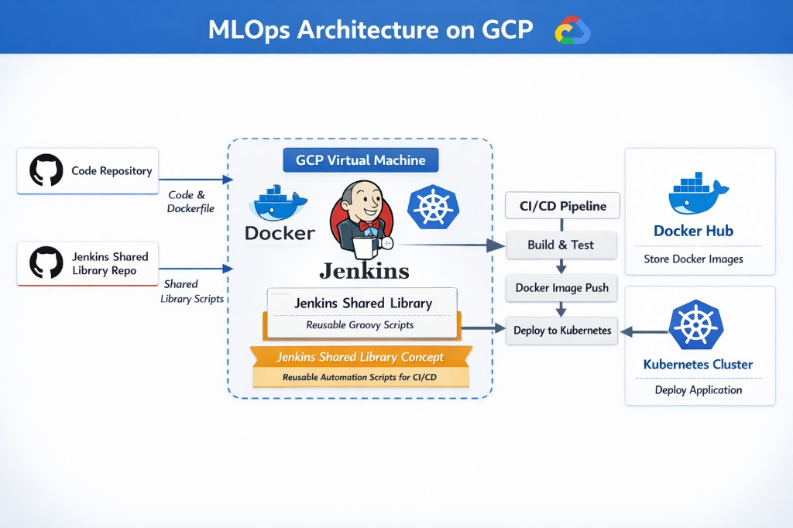
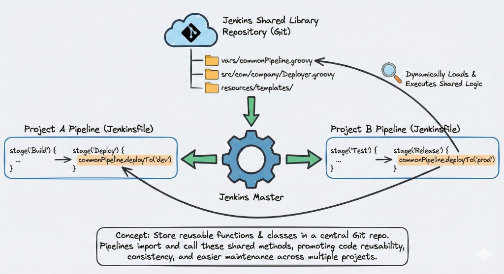

# Smart Manufacturing — Machine Efficiency Prediction

An end-to-end MLOps project that predicts manufacturing machine efficiency status (**High**, **Medium**, or **Low**) using sensor and operational data. The application is containerized with Docker, deployed to Kubernetes via a fully automated CI/CD pipeline powered by Jenkins Shared Libraries on Google Cloud Platform.



---

## Live Infrastructure Proof

### GCP VM Instance
The project runs on a Google Cloud Compute Engine VM (`us-central1-f`) with Docker, Minikube, and Jenkins installed.



### VM Setup — Docker, Minikube & kubectl
SSH session showing kubectl installation, Docker network configuration, and Jenkins container launch on the Minikube network.



### Jenkins Pipeline Builds
Successful CI/CD pipeline runs triggered via GitHub webhooks — builds #2, #3, #4 all passing after the initial setup.



---

## About This Project

In real-world manufacturing environments, predicting machine efficiency in real-time helps reduce downtime, optimize maintenance schedules, and improve overall equipment effectiveness (OEE). This project demonstrates a professional MLOps workflow that centralizes automation logic within a **Jenkins Shared Library**, ensuring that every build and deployment is standardized and reusable.

The focus is not just on building a machine learning model — it's on building the **entire production pipeline** around it: from data processing and model training, to containerization, CI/CD automation, and cloud-native deployment.

### What This Project Demonstrates

- **ML model development** — Training a classification model on real-world manufacturing sensor data
- **Production-grade serving** — A Flask web app that accepts sensor inputs and returns efficiency predictions
- **Jenkins Shared Libraries** — Writing reusable, modular Groovy scripts that standardize complex CI/CD pipelines across multiple projects
- **Containerization** — Packaging the entire application (code + model + dependencies) into a Docker image
- **Kubernetes orchestration** — Deploying and managing the containerized app using Kubernetes manifests
- **Cloud infrastructure** — Setting up a GCP VM with Docker, Jenkins, and Minikube to run the full pipeline
- **Webhook automation** — Auto-triggering the pipeline on every `git push` via GitHub webhooks

### Key Advantages

| Advantage | Description |
|---|---|
| **Reusability** | Shared Library scripts (`gitCheckout`, `dockerBuildAndPush`, `k8sDeploy`, etc.) can be reused across any number of projects without rewriting pipeline logic |
| **Consistency** | Every project that imports the library follows the same build, push, and deploy standards — reducing human error |
| **Scalability** | Adding a new microservice to the pipeline only requires a new Jenkinsfile — all heavy lifting is handled by the shared library |
| **Full automation** | A single `git push` triggers the entire flow: build, test, containerize, push to registry, and deploy to Kubernetes |
| **Separation of concerns** | ML code, infrastructure config, and CI/CD logic live in separate repos — each team can iterate independently |
| **Cloud-native** | The app runs on Kubernetes, making it easy to scale replicas, roll back deployments, and manage health checks |
| **Reproducibility** | Docker ensures the same environment runs locally, in CI, and in production — no "works on my machine" issues |

---

## Architecture



The pipeline follows this flow:

1. **Code push** to GitHub triggers a webhook
2. **Jenkins** (running in Docker on a GCP VM) picks up the change
3. Jenkins loads **reusable Groovy scripts** from a Shared Library repo
4. The pipeline **builds a Docker image**, pushes it to **Docker Hub**
5. The image is **deployed to a Kubernetes cluster** (Minikube) on the same GCP VM

---

## Jenkins Shared Library



Instead of duplicating pipeline logic across projects, reusable Groovy functions are stored in a central Git repository and imported by any Jenkinsfile using `@Library('jenkins-shared')`.

| Shared Library Script | Purpose |
|---|---|
| `vars/gitCheckout.groovy` | Checkout code from any Git repository |
| `vars/dockerBuildAndPush.groovy` | Build a Docker image and push it to Docker Hub |
| `vars/installKubectl.groovy` | Install `kubectl` inside the Jenkins agent |
| `vars/k8sDeploy.groovy` | Apply Kubernetes deployment and service manifests |

---

## Project Structure

```
.
├── application.py                 # Flask web application (inference server)
├── Dockerfile                     # Container image definition
├── Jenkinsfile                    # CI/CD pipeline definition
├── requirements.txt               # Python dependencies
├── setup.py                       # Package configuration
│
├── src/
│   ├── data_processing.py         # Data loading, preprocessing, scaling, splitting
│   ├── model_training.py          # Model training and evaluation (Logistic Regression)
│   ├── logger.py                  # Centralized logging
│   └── custom_exception.py        # Custom exception with traceback details
│
├── pipeline/
│   └── training_pipeline.py       # Orchestrates data processing + model training
│
├── notebook/
│   └── notebook.ipynb             # EDA and experimentation notebook
│
├── artifacts/
│   ├── raw/data.csv               # Raw dataset
│   ├── processed/                 # Scaled train/test splits + scaler (generated)
│   └── models/                    # Trained model pickle (generated)
│
├── k8s/
│   ├── deployment.yaml            # Kubernetes Deployment manifest
│   └── service.yaml               # Kubernetes Service manifest (NodePort)
│
├── templates/
│   └── index.html                 # Frontend HTML template
│
├── static/
│   └── style.css                  # Frontend styles
│
└── screenshots/                   # README images
```

---

## Tech Stack

| Layer | Technology |
|---|---|
| **Language** | Python 3.11 |
| **ML Model** | Logistic Regression (scikit-learn) |
| **Web Framework** | Flask |
| **Containerization** | Docker |
| **Orchestration** | Kubernetes (Minikube) |
| **CI/CD** | Jenkins with Shared Libraries |
| **Cloud** | Google Cloud Platform (Compute Engine) |
| **Version Control** | Git / GitHub |
| **Image Registry** | Docker Hub |

---

## ML Pipeline

The training pipeline (`pipeline/training_pipeline.py`) runs two stages:

### 1. Data Processing (`src/data_processing.py`)
- Loads raw CSV data from `artifacts/raw/data.csv`
- Parses timestamps and extracts `Year`, `Month`, `Day`, `Hour` features
- Label-encodes categorical columns (`Operation_Mode`, `Efficiency_Status`)
- Scales features using `StandardScaler`
- Splits data into 80/20 train/test sets (stratified)
- Saves processed artifacts as `.pkl` files

### 2. Model Training (`src/model_training.py`)
- Loads processed train/test splits
- Trains a `LogisticRegression` model (max_iter=1000)
- Evaluates with Accuracy, Precision, Recall, and F1 Score
- Saves the trained model to `artifacts/models/model.pkl`

### Input Features

| Feature | Description |
|---|---|
| `Operation_Mode` | Machine operating mode (encoded) |
| `Temperature_C` | Temperature in Celsius |
| `Vibration_Hz` | Vibration frequency |
| `Power_Consumption_kW` | Power consumption |
| `Network_Latency_ms` | Network latency |
| `Packet_Loss_%` | Network packet loss percentage |
| `Quality_Control_Defect_Rate_%` | Defect rate |
| `Production_Speed_units_per_hr` | Production speed |
| `Predictive_Maintenance_Score` | Maintenance prediction score |
| `Error_Rate_%` | Error rate percentage |
| `Year`, `Month`, `Day`, `Hour` | Timestamp components |

### Prediction Output
- **High** — machine is operating at high efficiency
- **Medium** — moderate efficiency
- **Low** — low efficiency, may need attention

---

## Getting Started

### Prerequisites
- Python 3.11
- Docker
- Git

### Local Setup

```bash
# Clone the repository
git clone https://github.com/kiwa-debug/MLOPS-Jenkins-shared-lib.git
cd MLOPS-Jenkins-shared-lib

# Create virtual environment
python -m venv .venv

# Activate (Windows)
.venv\Scripts\activate

# Install dependencies
pip install -e .

# Run the training pipeline
python pipeline/training_pipeline.py

# Start the Flask app
python application.py
```

The app will be available at `http://localhost:5000`.

### Docker

```bash
# Build
docker build -t kirtish07/jenkins-shared-mlops-project .

# Run
docker run -p 5000:5000 kirtish07/jenkins-shared-mlops-project
```

---

## CI/CD Pipeline

The `Jenkinsfile` defines a four-stage pipeline:

```
Checkout  -->  Build & Push Image  -->  Install Kubectl  -->  Deploy to Kubernetes
```

| Stage | What it does |
|---|---|
| **Checkout** | Clones the application repository from GitHub |
| **Build & Push Image** | Builds the Docker image and pushes to Docker Hub |
| **Install Kubectl** | Installs `kubectl` on the Jenkins agent |
| **Deploy to Kubernetes** | Applies `k8s/deployment.yaml` and `k8s/service.yaml` |

### Jenkins Credentials Required

| Credential ID | Type | Purpose |
|---|---|---|
| `github-token` | Username + Password | GitHub Personal Access Token |
| `dockerhub-token` | Username + Password | Docker Hub Access Token |
| `kubeconfig` | Secret File | Kubernetes cluster config |

### GitHub Webhook (Auto-trigger)

Configure a webhook in your GitHub repo settings:
- **Payload URL:** `http://<JENKINS_IP>:8080/github-webhook/`
- **Content type:** `application/json`
- **Events:** Just the push event

Enable **"GitHub hook trigger for GITScm polling"** in the Jenkins job configuration.

---

## Kubernetes Deployment

The application is deployed as a single-replica Deployment with a NodePort Service:

- **Container Port:** 5000
- **NodePort:** 30080

Access the deployed app:
```bash
kubectl port-forward deployment/flask-deployment 5000:5000 --address 0.0.0.0
```
Then visit `http://<VM_EXTERNAL_IP>:5000`.

---

## GCP Infrastructure Setup

| Component | Specification |
|---|---|
| **VM Instance** | E2 Standard, 16 GB RAM, 150 GB disk |
| **OS** | Ubuntu 24.04 LTS |
| **Docker** | Installed from official docs |
| **Minikube** | Single-node Kubernetes cluster (uses Docker driver) |
| **Jenkins** | Runs as a Docker container (DIND mode) on the `minikube` network |
| **Firewall** | Ingress rule allowing all traffic (for demo purposes) |

---

## Author

**Kirtish Wankhedkar**

- GitHub: [@kiwa-debug](https://github.com/kiwa-debug)
- Docker Hub: [kirtish07](https://hub.docker.com/u/kirtish07)
